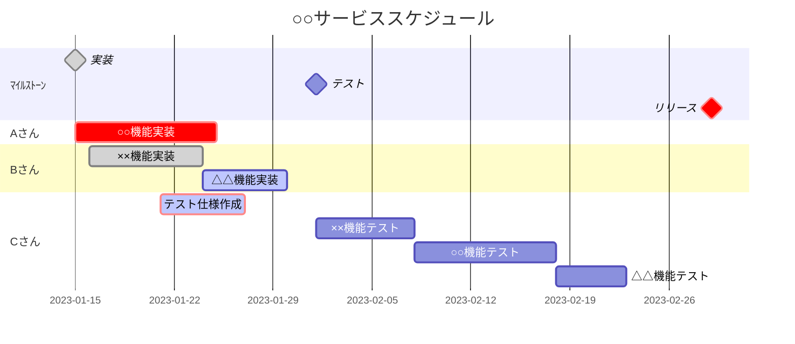
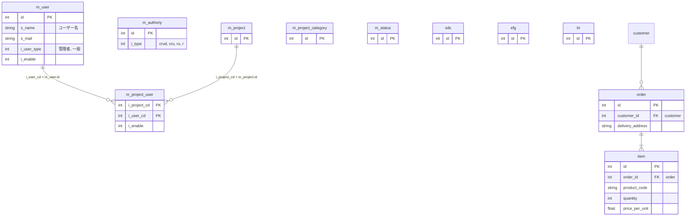
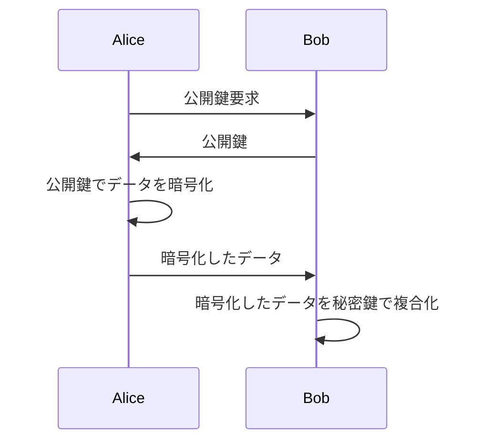
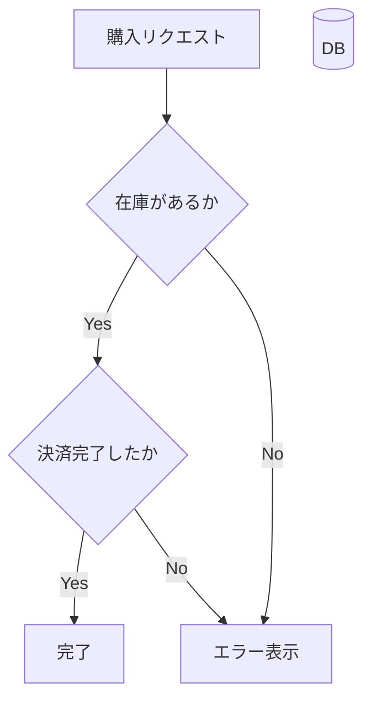

試したい技術があるときに、サクッと環境を用意するためのテンプレです。

mermaid サンプル

```mermaid
gantt
    title ○○サービススケジュール
    dateFormat  YYYY-MM-DD

    section ﾏｲﾙｽﾄｰﾝ
        実装            : done, milestone, 2023-01-15, 0d
        テスト          : milestone, 2023-02-01, 0d
        リリース        : crit, milestone, 2023-03-01, 0d
    section Aさん
        ○○機能実装    : crit, 2023-01-15, 10d
    section Bさん
        ××機能実装    : done, b1, 2023-01-16, 8d
        △△機能実装    : active, b2, after b1, 6d
    section Cさん
        テスト仕様作成  : crit, active, c1, 2023-01-21, 6d
        ××機能テスト  : c2, 2023-02-01, 7d
        ○○機能テスト  : c3, after c2, 10d
        △△機能テスト  : c4, after c3, 5d
```

```mermaid
erDiagram
  m_user {
          int id PK
          string s_name "ユーザー名"
          string s_mail
          int i_user_type "管理者, 一般"
          int i_enable
      }
  
  m_authoriy {
    int id PK
    int i_type "crud, cru, ru, r"
  }
  
  m_project {
    int id PK
  }

  m_project_category {
    int id PK

  }
  
  m_status {
    int id PK

  }

   sds {
    int id PK

  }
   efg {
    int id PK

  }
   br {
    int id PK

  }

  m_project_user {
    int i_project_cd PK
    int i_user_cd PK
    int i_enable
  }

  m_user ||--o{  m_project_user: "i_user_cd = m_user.id"
  m_project ||--o{ m_project_user: "i_project_cd = m_project.id" 

    order {
        int id PK
        int customer_id FK "customer"
        string delivery_address
    }
    customer ||--o{ order : ""

    item {
        int id PK
        int order_id FK "order"
        string product_code
        int quantity
        float price_per_unit
    }
    order ||--|{ item : ""
```

```mermaid
sequenceDiagram

Alice->>Bob: 公開鍵要求
Bob->>Alice: 公開鍵
Alice->>Alice: 公開鍵でデータを暗号化
Alice->>Bob: 暗号化したデータ
Bob->>Bob: 暗号化したデータを秘密鍵で複合化
```

```mermaid
graph TD

Buy[購入リクエスト]
IfStockExists{在庫があるか}
IfPaymentSuccess{決済完了したか}
ShowError[エラー表示]
Complete[完了]

Buy --> IfStockExists
IfStockExists -->|Yes| IfPaymentSuccess
IfStockExists -->|No| ShowError

IfPaymentSuccess -->|Yes| Complete
IfPaymentSuccess -->|No| ShowError

F[(DB)]
```